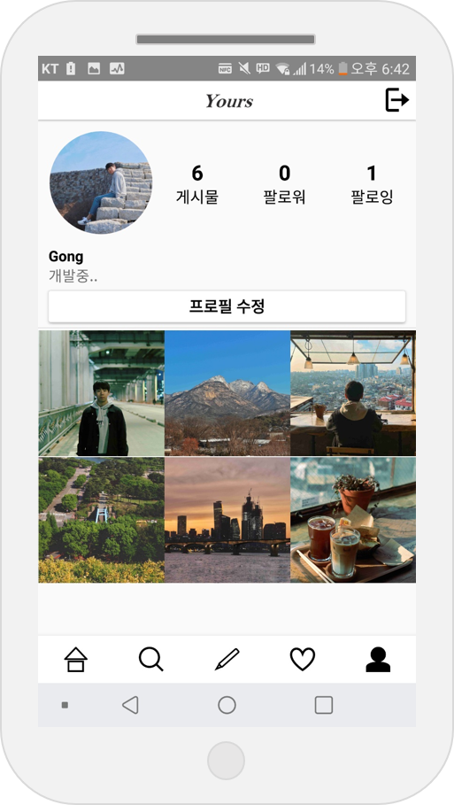

# CloneSNS (Yours)
>THIS APPLICATION IS JUST AN EXAMPLE

## STACK
> 1. Android(java)
> 2. Firebase(Auth,firestore, firestorage, FCM)

## Library
> 1. Glide
> 2. CropImageView
> 3. okhttp3
> 4. JSON, GSON
> 5. Fishbun(images picker)

## Function
 ### 0.Login
> You can login using facebook or google.
>
> </img>

 ### 1.Timeline
> You can see posts on this tab.
>
> </img>

 ### 2.GridTimeline
> You can see grid posts on this tab.
>
> </img>

 ### 3.Upload
> You can upload a post on this tab.
>
> </img>

 ### 4.Alarm
> You can see alarms on this tab.
>
> </img>

 ### 5.profile
> You can see a profile on this tab.
>
> </img>

 ### 6. other functions
> comment, follow, like

## Contact
> Email. knmy0101@naver.com

